# IoT Based Hydroponic System

 **Description:**  
    The idea behind this project is to automate the Hydroponic system,to make monitoring easy.That will reduce the human effort in hydroponic cultivation and will make agriculture as well as fresh food ensurity possible in urban life.

**Hardware Specifications:**

This Hardware section can be classified in 3 sub sections: 
* **Sensing**: Basically six types of sensors used in monitoring the water.medium and environment. These are:
   1. Analog pH sensor v1.[Shop link here.](https://store.roboticsbd.com/sensors/523-analog-ph-sensor-meter-kit-for-arduino-robotics-bangladesh.html)  
   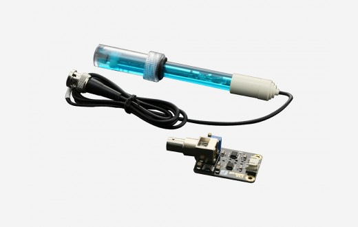
   1. EC sensor. [Shop link here.](https://botland.store/gravity-series/10304-gravity-analog-electrical-conductivity-sensor-meter-for-arduino.html)  
   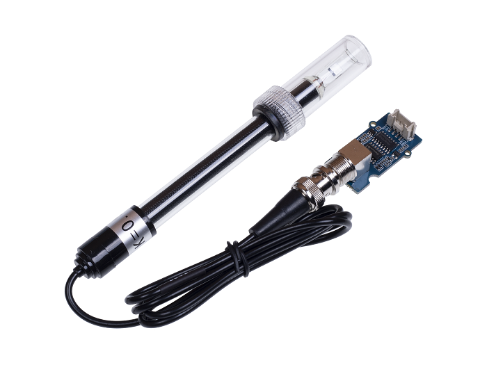 
   1. DHT-22 humidity and temperature sensor. [Shop link here.](https://www.indiamart.com/proddetail/dht22-temperature-humidity-sensor-19774383691.html)  
   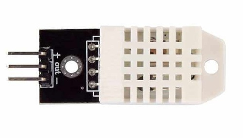 
   1. DS18B20 water temperature sensor. [Shop link here.](https://store.roboticsbd.com/robotics-parts/414-waterproof-ds18b20-digital-thermal-probe-or-sensor-robotics-bangladesh.html)  
   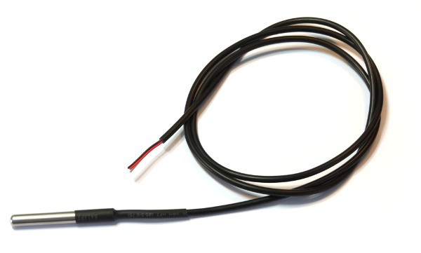 
   1. DS3231 RTC Module. [Shop link here.](https://www.indiamart.com/proddetail/ds3231-real-time-clock-module-22190509333.html)  
   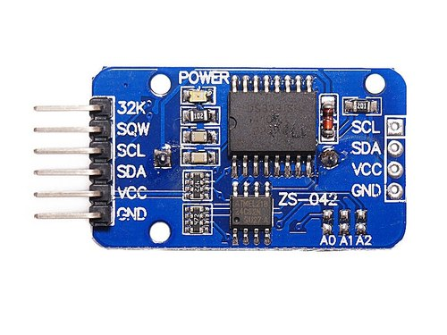 
   1. Water level sensor. [Shop link here.](https://www.indiamart.com/proddetail/water-level-float-sensor-11877060712.html)  
   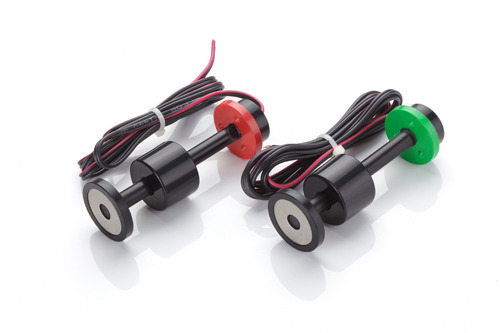
* **Actuation**: In this system five types of actuators used in different puposes.Such as:
    1.  20*4 LCD Display. [Shop link here.](techshopbd.com/product-categories/lcd/649/lcd-display-20x4-techshop-bangladesh)  
    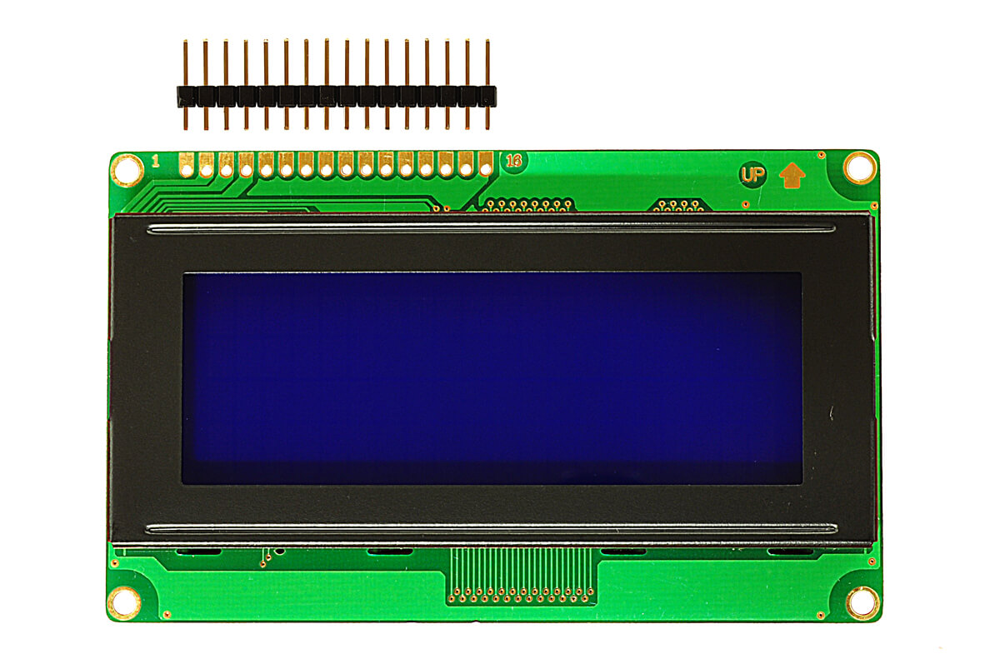
    1.  AC water pump.[Shop link here.](https://www.aliexpress.com/item/32818678708.html)  
    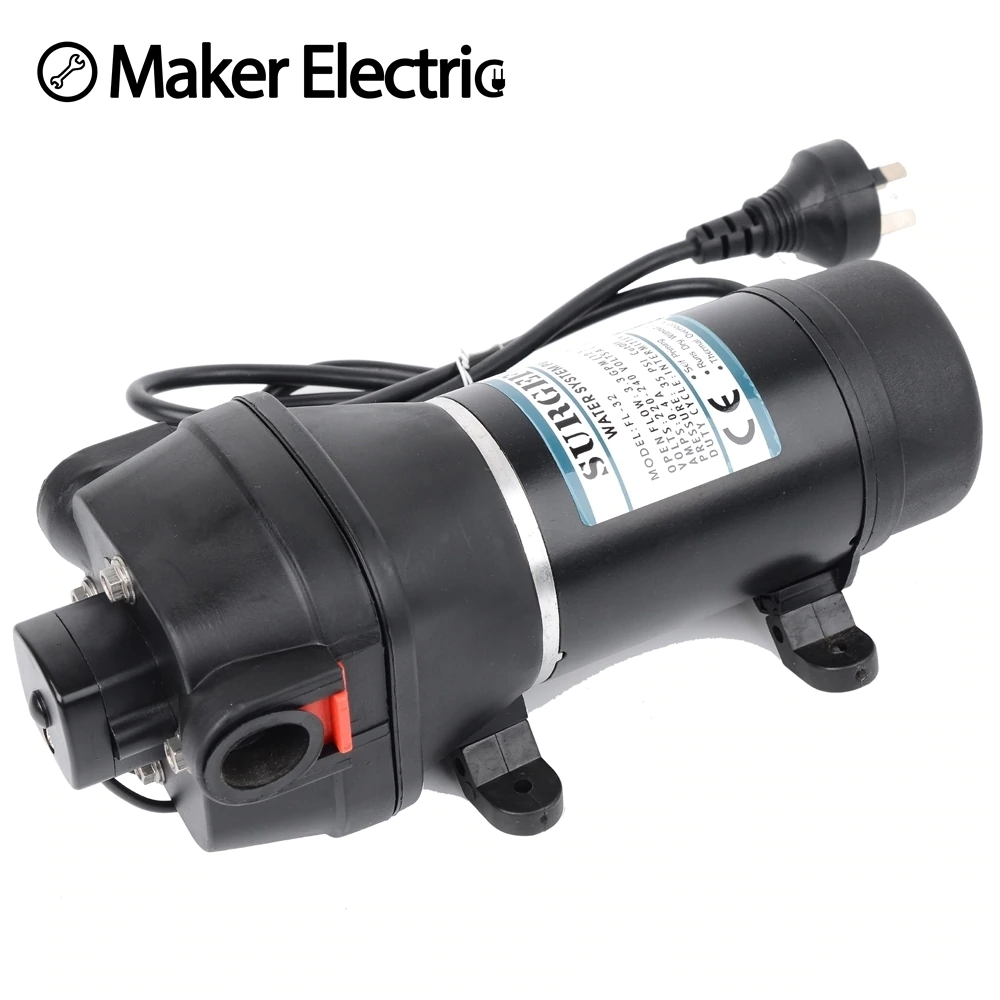
    1.  DC water pump. [Shop link here.](https://www.daraz.com.bd/products/dc-water-pump-3-6v-mini-submersible-pump-120lh-i168456295.html)  
    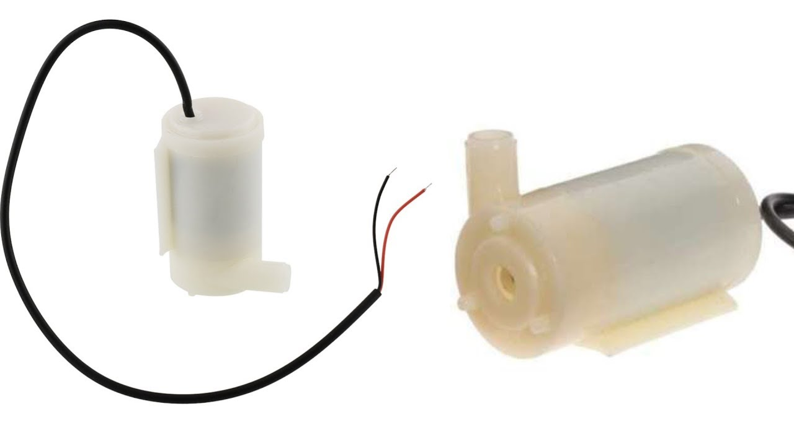
    1.  Grow light.[Shop link here.](https://www.aliexpress.com/item/32284606893.html)  
    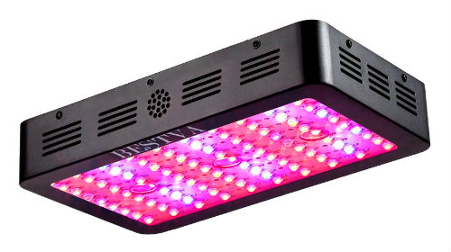
    1.  Air pump.[Shop link here.](https://www.amazon.com/Saim-Motor-Aquarium-Oxygen-Circulate/dp/B01MT7B2A8)  
     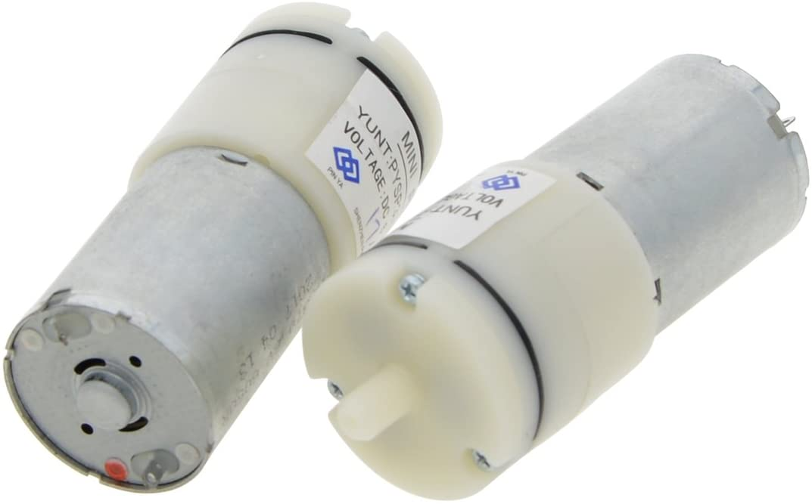
    1.  Relay module.[Shop link here.](https://www.roboelements.com/product/5v-4-channel-relay-module-arduino-optocoupler/)  
     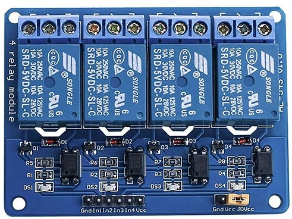
* **Computation**: In case of logic control,data manupulation Arduino Mega(ATMEGA 2560) is used.[Shop link here.](https://amperka.com/products/arduino-mega-2560)  
      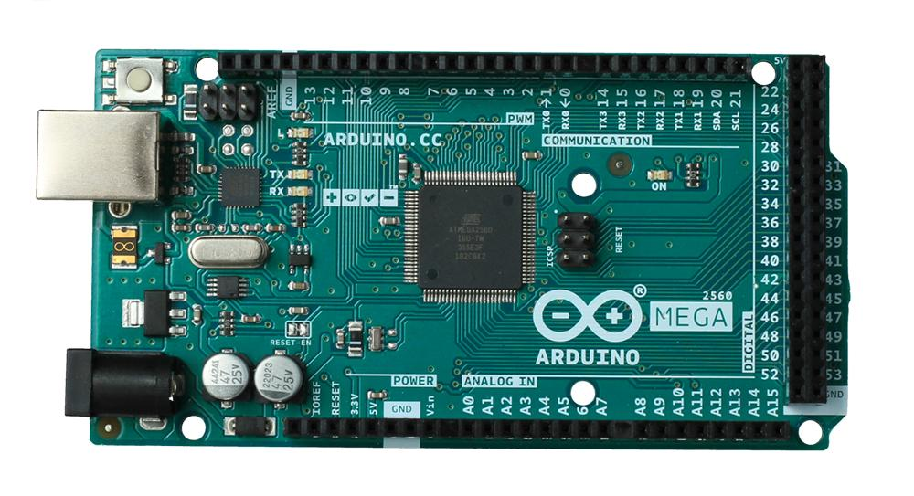

* **Comumication**: As communication modul, Nodemcu esp8266 SoC is used.That basically collects the data from arduino mega and POST the data packet to the [IoT web platform](https://thingspeak.com/).[Shop link here.](https://www.elektor.com/nodemcu-microcontroller-board-with-esp8266-and-lua)  
   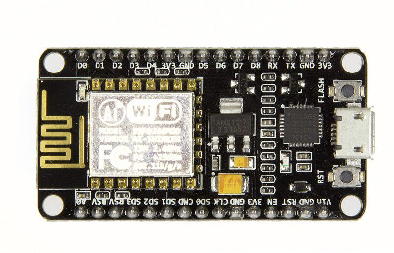

**Circuit Layout:**  
Here is the circuit layout of the electronic system.  
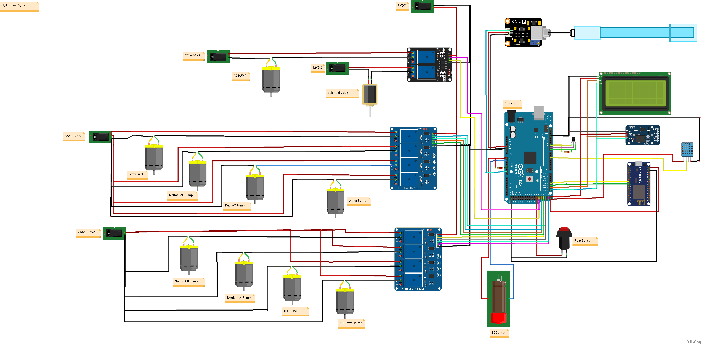

**Prototype View:**   
Here is some pictures of the prototyped system.  
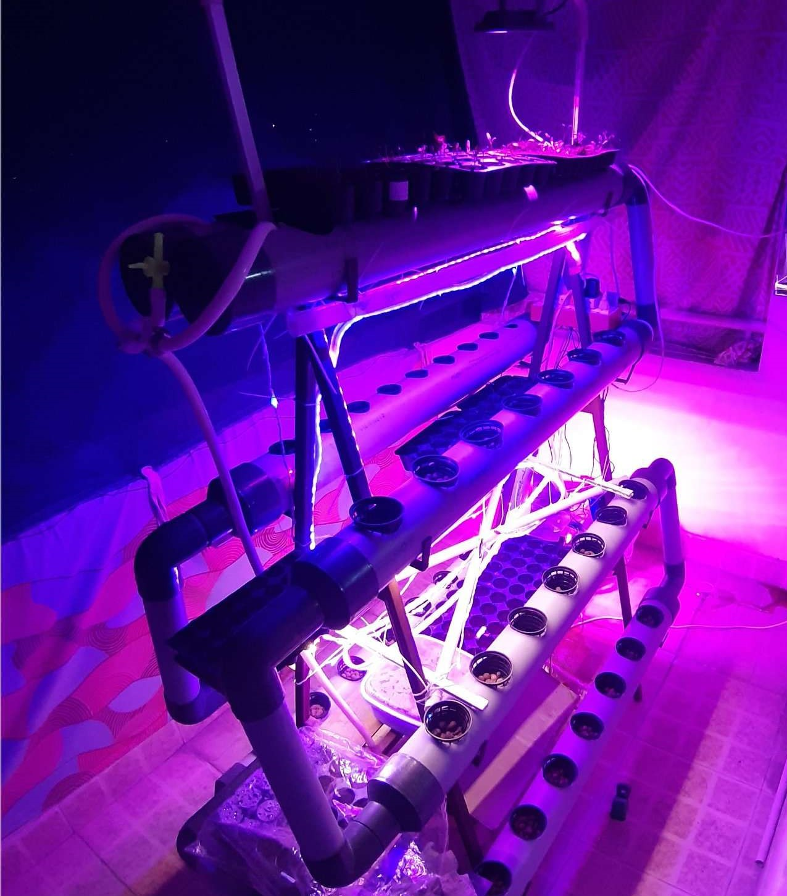
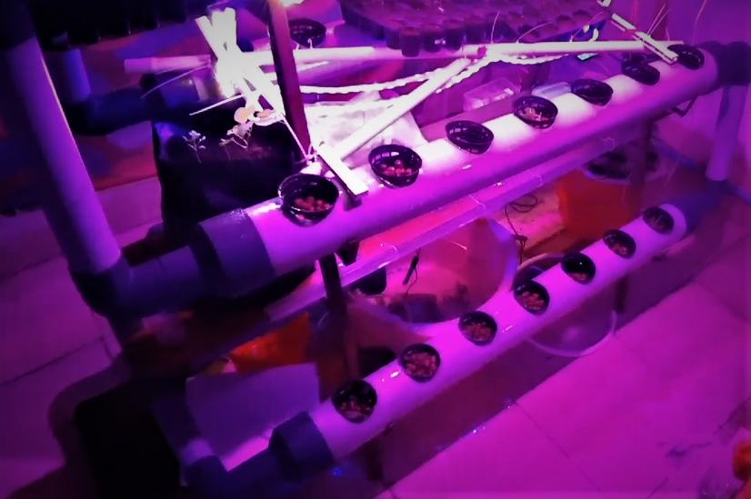
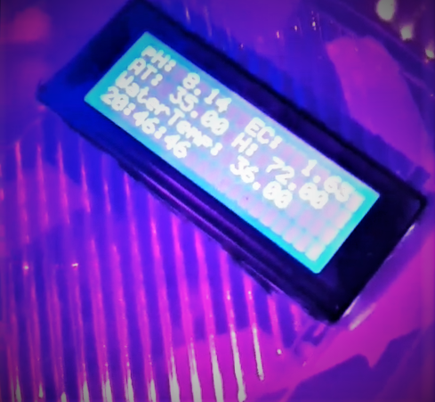

**IoT web app:**  
     Here is the picture of the phenomenon of automatic stabilization through thingspeak.com.    
     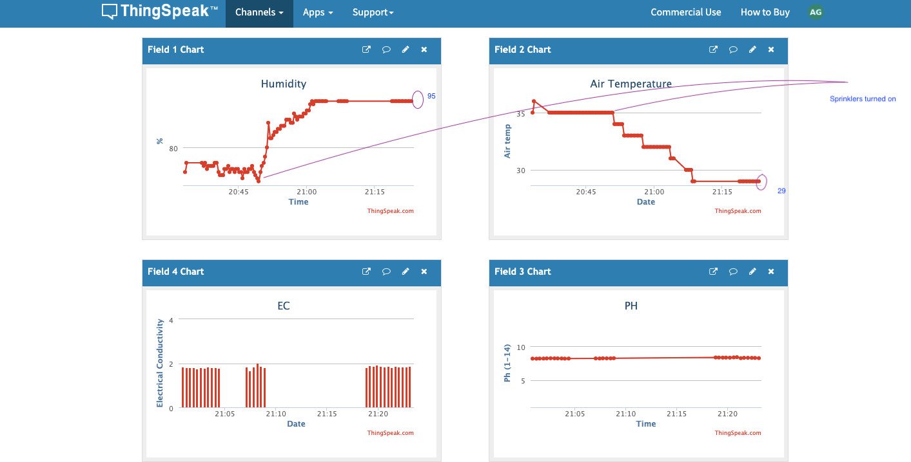